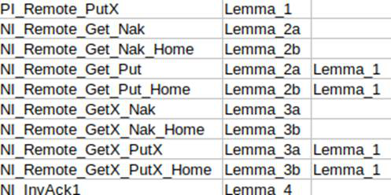

# auto-CMP

We implemented a framework auto-CMP to automate the CMP method for parameterized verification, including automated guard strengthening and abstraction procedures. Moreover, our tool murphiGen can automatically generate the abstract protocol model in a file absProt.m with the information for strengthening; on the other side, tool proofGen can automatically generate a proof script Prot.thy certificating the correctness of the protocol.

# Requirement

Isabelle 2021 

https://isabelle.in.tum.de/installation.html

Python 3.8.12

Lark 1.1.2

# Run an Example

1.   Download the software and libraries mentioned above

2.   Run the file murphiGen.py --task prot, in which the parameter ‘prot’ represents the name of protocol you want to verify. It will automatically perform CMP work using abs_process.csv in the folder corresponding to the protocol until ‘success!’ is displayed on the terminal.

python murphiGen.py --task mutualEx

After step 3, a file named ABSprot.m will appear in the path ./prot/, which is the final abstract protocol. 

3.   Then run proofGen.py --task prot to generate the proof file prot.thy(prot has the same meaning as above). This program will first generate a prot_str.json file in the directory of prot using abs_process.csv and ABSprot.m mentioned above, which records the enum type of the protocol and the description of the rule (detailed below). This file and the abstract protocol ABSprot.m are used to generate the prot.thy proof file. You can complete the proof process by putting the file into Isabelle.

python proofGen.py --task mutualEx

## ABSprot.m

The ABSprot.m is an abstraction of the original protocol. It contains the original and abstracted rules, as well as variable definitions, initializations, and invariants, etc.

## abs_process.csv

The abs_process.csv file records the protocol strengthening information, including which rules were strengthened and which lemmas were used in the process. Notice that these processes are recorded in sequence.

As shown above, flash is strengthened in order: ‘PI_Remote_PutX’, ‘NI_Remote_Get_Nak’,‘NI_Remote_Get_Nak_Home’,‘NI_Remote_Get_Put’ … For ‘NI_Remote_Get_Put’, using Lemma2a,Lemma1 to strengthen it According to the order.

## prot_str.json

prot_str.json records the information of protocol. 

The first item “enum_typs” records elements of type “enum” in the protocol, and the following items contain information about each rule or ruleset. In these items, the first element is the name of a rule or ruleset, and the next are the names of the noninterference lemmas used to strengthen their guard. Note that these lemmas are listed in reverse order of use. 

The third element named “answer”, which is the name of original rule (or ruleset) to distinguish between its abstracted rule. 

The last element, “abstract”, represents abstract information about rules. In this element, “cond” is the signal of parameter information, and when a parameter is false, that parameter is abstracted for this rule. Similarly, “answer” in “abstract” represents the name of the ruleset, except that the name of the abstract ruleset is prefixed or suffixed. Since rules only have global variables that do not need to be abstracted, their terms “strengthen” and “abstract” are empty.

Take the mutualEx protocol as an example: its first item contains its enum type, "state", and then in the last item, "ruleset" means that the ruleset is "Idle" and "strengthening" means that "Lemma_1" is used to strengthen the rule. Its original rule name is "Idle_ref", while its abstract rule name is "ABS_Idle", which are both contained in "answer".

In the other items, the "strengthen" of "Crit" is empty because its abstract form is the same as the original rule and has not been strengthened. "Try" and "Exit" don't exist after abstraction, so the content in "answer" is replaced by "skipRule".

 [

{

  "enum_typs": [

​      "state"

   ]

},

{

  "ruleset": "Try",

  "strengthen": [  

  ],

  "answer": "Try_ref",

  "abstract":[{"cond":{"i": true},"answer":"Try_ref"},{"cond":{"i": false},"answer":"skipRule"}]

},

{

  "ruleset": "Crit",

  "strengthen": [

  ],

  "answer": "Crit_ref",

  "abstract":[{"cond":{"i": true},"answer":"Crit_ref"},{"cond":{"i": false},"answer":"ABS_Crit"}]

},

{

  "ruleset": "Exit",

  "strengthen": [  

  ],

  "answer": "Exit_ref",

  "abstract":[{"cond":{"i": true},"answer":"Exit_ref"},{"cond":{"i": false},"answer":"skipRule"}]

},

{

  "ruleset": "Idle",

  "strengthen": [

​    "Lemma_1"

  ],

  "answer": "Idle_ref",

  "abstract":[{"cond":{"i": true},"answer":"Idle_ref"},{"cond":{"i": false},"answer":"ABS_Idle"}]

}

]

 

## Prot.thy

Prot.thy consists of the following parts:

1. Definitions of formally parameterized rules and the initial state of the original protocol under study, which can be directly transformed from the internal model which is in turn compiled from Murphi rules of the protocol. The set of all the parameterized rules are defined in a set ***rules\***.

2. Definitions of parameterized invariant formulas ***inv_i\*** for strengthening, which are generated by external oracle or human. All invariant formulas used to strengthen a rule ***r\*** is collected in an invariant list ***invsFor_r.\*** All such invariant in lists ***invsFor_r\*** are collected in an set ***invS\***. Accordingly, we define ***inv'\*** for those for observation, and an invariant list ***invs'For_r\***, and ***invS'\*** accordingly.

3. Definitions of rules ***r_ref\*** of the parameterized protocol by strengthening some original protocol rule ***r\*** with invariant list ***invsFor_r\***, which can be generated in the CMP phase. The set of all the parameterized rules are defined in a set ***rules_ref\***.

4. Definitions of rules of the abstracted protocol model, which can be generated in the CMP~ phase. The set of all the parameterized rules are defined in a set ***ABSrules.\***

5. Definitions of the types of variables used in this protocols by a function ***env\***. 

6. Lemmas that guaranttees obligations of the symmetry of strengthened rule ***r_ref\***, and invariant formulas ***inv_i\*** and initial state specification formulas ***init_i\***, which is required in obligation in the main theorem.

7. A lemma which guaranttees the obligation  which states that ***rules_ref\***. is strengthened by ***rules\*** with ***invS\*** in main theorem. 

8. A lemma which proves the obligation that ***ABSrules(M)\*** is indeed the image of the rule abstracting function ***absRuleTranfer\*** ~on the middle set ***rules_ref\*** with a cut-off parameter ***M\***. 

9. A lemma which proves the obligation that is the correspondence between ***invS\*** --lists of invariants for strengthening rules and ***invS’--\*** invariants for observation.

10.  A lemma which proves the obligation that ***invS’--\***the lists of invariants for observation is safe and well typed by ***env\***. In fact, we can furthermore that the abstraction results of these invariants is the same as themself in our case studies.

11.  Lemmas which prove that original rules and those in the middle reference protocol (the strengthening result) ***rules_ref\*** are well typed. 

12. A lemma which proves that the initial state specification formulas ***inv_i\*** are also well-typed. 

13. The main theorem ***absProtSim\*** states the correctness of the parameterized protocol under the assumption that the model checking of the abstracted protocol is positive.

 

# Results

In the main directory, we place the main results of our work:

1. The abstract protocol model in Murphi:

(1)     AbsmutualEx.m

(2)     AbsGerman.m

(3)     AbsMesi.m

(4)     AbsFlash.m

2. The Isabelle Proof Script file:

(1)     MutualEx.thy

(2)     German.thy

(3)     Mesi.thy

(4)     Flash.thy

 